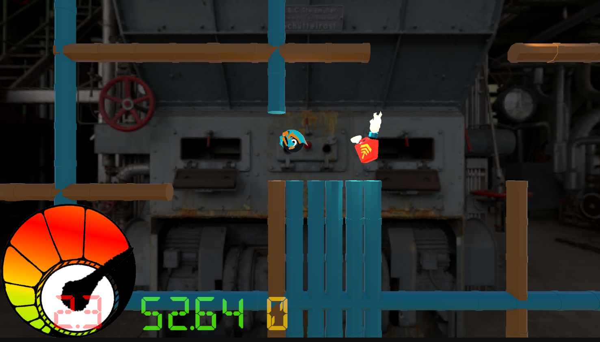

# {【ROTAT】}

## ゲームの内容
後60秒でこの工場は崩壊してしまう!?
重力回転の力を使って最速脱出を目指せ!!

エンジンをかけたら止まらないロードタイヤ！しかし壁にぶつかると重力を回転させて壁を登りはじめる！ギアのジャンプを駆使してパイプを乗り継ぎゴールを目指そう！

## 操作説明
- 【ジャンプ】スペースキー・左クリック・コントローラーのⒶorⒷ
- 【エンジン】スタート時に【ジャンプ】ボタンを連打することでプレイヤーのエンジンがかかります！
